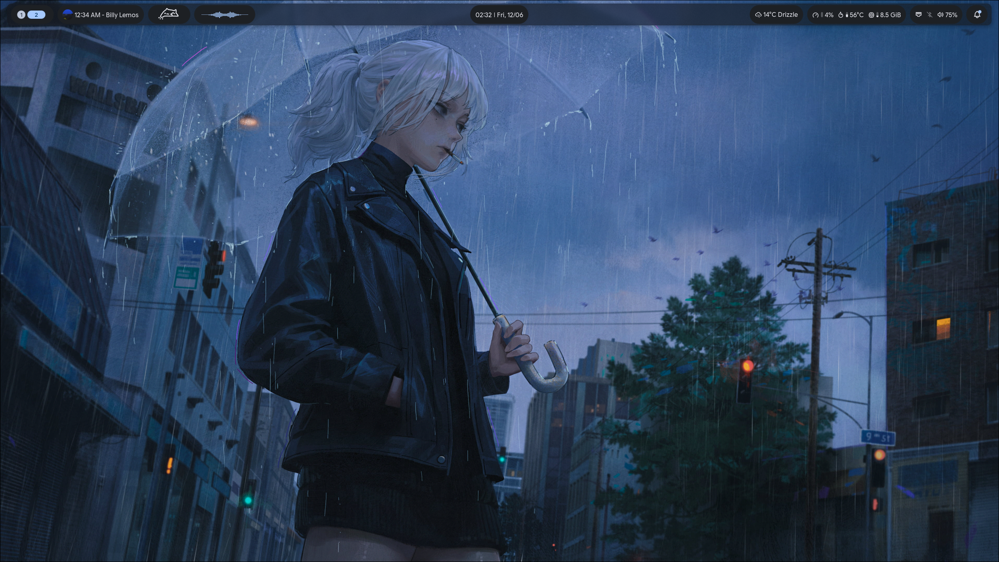

<div align="center">
  <h1>Digit’s Hyprland Dotfiles</h1>
  <p><b>Hyprland • Noctalia v5 • Personal desktop environment</b></p>
</div>

---

## Overview

A personal Hyprland configuration built around **Noctalia v5**, designed for daily use, workflow efficiency, and a clean modular desktop experience.

<details>
<summary><b>What is this?</b></summary>

This is a fully custom Hyprland setup focused on usability, consistency, and performance rather than being a full Linux distribution or installer.

- Built around **Noctalia v5** as the core shell/UI layer  
- Workflow-first desktop configuration  
- Clean separation between compositor, shell, and applications  
- Lightweight and fast with minimal overhead  
- Fully custom configuration and structure  

References:
- Noctalia Docs: https://docs.noctalia.dev/
- Hyprland Docs: https://wiki.hypr.land/

</details>

<details>
<summary><b>Features</b></summary>

- Workspace system with live window tracking  
- Noctalia v5 shell (panels, widgets, system controls, theming)  
- Productivity tooling (screen tools, shortcuts, quick actions)  
- Fast config reload workflow (Hyprland + shell separation)  
- Minimal, consistent UI design  
- Fully Lua-based Hyprland config  

</details>

<details>
<summary><b>Installation</b></summary>

⚠️ Requires Hyprland 0.55+ (Lua config)

### Base system
Install Hyprland using your distro’s package manager or official documentation.

### Dotfiles

```bash
git clone https://github.com/Digitlol/Digit-dotfiles
cd Digit-dotfiles
```

Copy configuration folders into:

```bash
~/.config
```

</details>

<details>
<summary><b>Keybinds (Noctalia v5)</b></summary>

### Core
- `Super` → Launcher  
- `MainMod + N` → Control Center  
- `Ctrl + Alt + Delete` → Session menu  
- `Ctrl + Super + T` → Wallpaper panel  
- `Super + V` → Clipboard  

### System
- `MainMod + I` → Settings  
- `MainMod + L` → Lock session  
- `MainMod + Shift + L` → Suspend system  

### Tools
- `MainMod + Shift + S` → Screenshot selection  

### Reload
- `Ctrl + Super + R` → Restart Noctalia + reload Hyprland  

</details>

---

## Stack

- **Hyprland** → Wayland compositor  
- **Noctalia v5** → Shell + UI system (core layer)  
- **System tools** → Utilities, launchers, and workflow applications  

---

## Screenshots

<p align="center">
  
</p>

---

## Notes

- This is a personal configuration, not a distribution  
- Expect frequent changes as workflow evolves  
- Designed for speed, clarity, and daily usability
